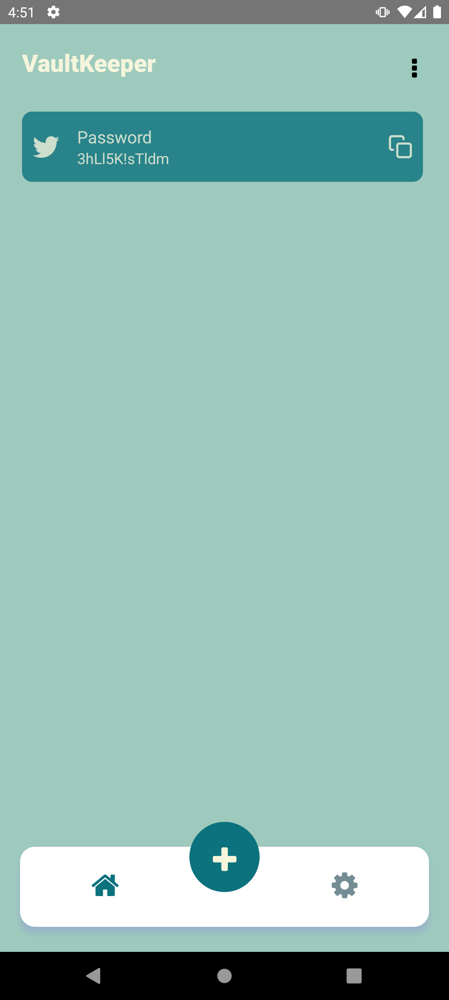
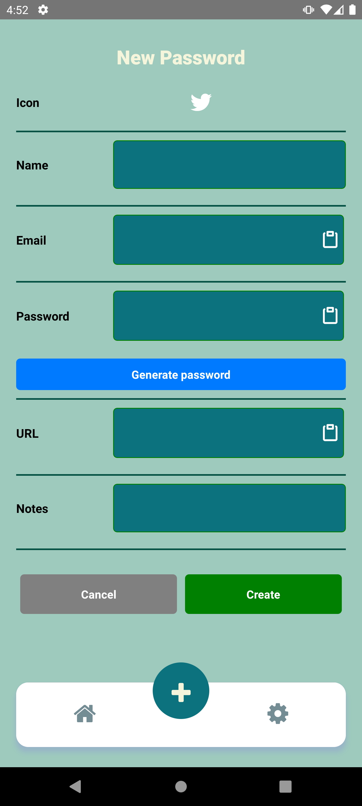
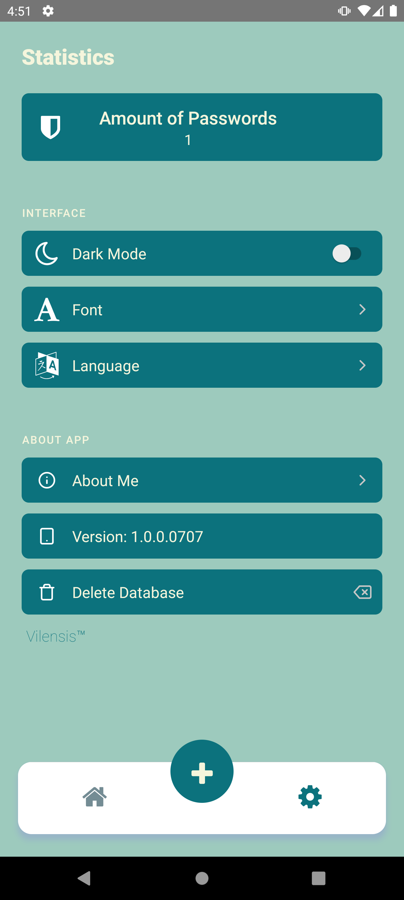
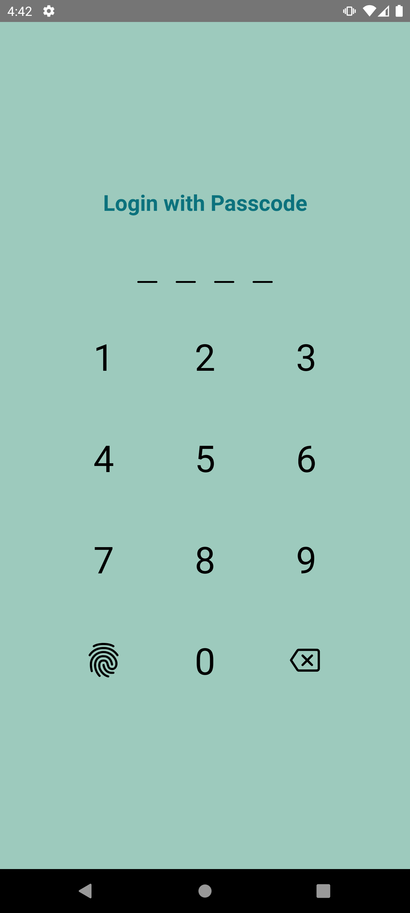

# VaultKeeper 🔐

**VaultKeeper** is a secure and stylish mobile password manager built with **React Native CLI**. Designed for everyday users who value privacy, customization, and smooth UX.

---

## 🧩 Features

- 🔐 **Local password storage** using **SQLite** for secure data storage.
- 🔍 **Password search** functionality to easily find your entries.
- 📱 **Fingerprint & password-based authentication** (via Touch ID).
- 🌐 **Multilingual support** (English, Ukrainian) using i18next.
- 🎨 **Theme switching** (light/dark mode) for a personalized experience.
- 🔧 **Adjustable font size** for better accessibility.
- 🧭 **Smooth Bottom Tab Navigation** for easy navigation.
- ➕ **Add new passwords** with multiple fields (email, login, password, etc.).
- 🖼️ **Category-based icons** using vector icons.
- 📤 **Native sharing functionality** to share your passwords securely.

> This app **does not rely on Expo**. It's built entirely with **React Native CLI**.

---

## 📸 Screenshots

| Home                                   | Add Password                         | Settings                                       | Login                                    |
| -------------------------------------- | ------------------------------------ | ---------------------------------------------- | ---------------------------------------- |
|  |  |  |  |

---

## ⚙️ Tech Stack

- **React Native CLI** – core framework for building the app
- **SQLite** – for secure local data storage
- **React Navigation** – for navigation and bottom tabs
- **AsyncStorage** – for storing preferences
- **i18next** – for localization
- **Touch ID** – for biometric authentication
- **Vector Icons** – for sleek visual experience

---

## 🛠️ Setup Instructions

### Clone the repository

```
git clone https://github.com/VilenSolovey/VaultKeeper.git
cd VaultKeeper
```

### Install dependencies

`npm install`

### For iOS

`cd ios && pod install && cd ..`

### Start the app

#### For Android

`npx react-native run-android`

#### For iOS

`npx react-native run-ios`

## Feel free to reach out for questions or suggestions.
